<div align="center">

<picture>
  <source media="(prefers-color-scheme: dark)" srcset="Rannah/docs/assets/header-dark.svg">
  
</picture>

<p>
  <a href="https://github.com/Mod578/Rannah/actions/workflows/ci.yml"></a>
  <a href="https://github.com/Mod578/Rannah/releases/latest"></a>
  
</p>

</div>

**Rannah** (رَنّة) is an Arabic reminders app for Android. It handles the three things a reminder actually needs: ring at the right moment, survive a reboot, and let you answer it once. One-time, daily and recurring reminders, snooze, completion confirmation, and Hijri dates next to Gregorian.

It works entirely offline. There is no account, no analytics, and the app declares no internet permission at all.

**Status:** released and in use. Version 1.1.0 is on the [releases page](https://github.com/Mod578/Rannah/releases/latest), with an APK, an app bundle and a `SHA256SUMS.txt` to check them against.

## Install

1. Download `rannah-1.1.0.apk` from the [latest release](https://github.com/Mod578/Rannah/releases/latest).
2. Open it and allow installation from this source when Android asks.
3. Grant the notification and exact alarm permissions on first launch, otherwise reminders cannot ring on time.

Requires Android 8.0 or newer.

## Features

- One-time, daily, weekly, monthly and yearly reminders
- Snooze by your default duration, or by a duration you pick for a single occurrence
- Skip today's occurrence without breaking the series
- Confirm completion with a deliberate slide, so a half-awake tap never records a task as done
- Pause and resume a recurring reminder
- Hijri dates alongside Gregorian, with a user adjustment offset
- Arabic natural language entry: «ذكرني كل يوم الساعة ٩ بالدواء» becomes a scheduled daily reminder
- Home screen widget showing the next reminder
- Fully Arabic, right to left throughout

## How it works

The database is the source of truth and every alarm is derivable from it. Nothing about a reminder lives only in `AlarmManager`, so a reboot, a process death, a clock change or an app update can rebuild the whole schedule without losing anything.

`ReminderScheduler` owns the lifecycle, and every action through it is idempotent, so a replayed broadcast or a double tap cannot give one occurrence two outcomes.

Full notes in [ARCHITECTURE.md](Rannah/docs/ARCHITECTURE.md).

## Build from source

Requires JDK 17 and the Android SDK at API level 35.

```bash
cd Rannah
./gradlew testDebugUnitTest   # unit tests
./gradlew lintDebug           # Android Lint
./gradlew assembleDebug       # installable debug build
```

The APK lands in `app/build/outputs/apk/debug/`. Release builds read their signing credentials from a properties file outside the repository, and still assemble unsigned when that file is absent.

<details>
<summary><b>Project layout</b></summary>

```
Rannah/
├── app/src/main/java/com/bal/reminders/
│   ├── ui/            Compose screens and ViewModels
│   ├── domain/        models, recurrence, occurrence state
│   ├── data/          Room database, DAO, repository, settings
│   ├── scheduling/    lifecycle owner, alarms, notifications, receivers
│   ├── parser/        Arabic text to a schedule
│   ├── format/        Gregorian and Hijri formatting
│   └── widget/        home screen widget
├── app/src/test/      JVM unit tests
├── app/schemas/       exported Room schemas, used by the migration tests
└── docs/              architecture and privacy
```

</details>

## Tech stack


## Privacy

No account, no ads, no analytics, no tracking. Reminder data is stored locally on the device.

One honest caveat: Android's own backup may copy the app's data to your Google account, depending on your device settings. The [privacy statement](Rannah/docs/PRIVACY.md) says so plainly rather than claiming everything stays on the device.

<details>
<summary><b>بالعربية</b></summary>

<div dir="rtl">

**رَنّة** تطبيق عربي للتذكيرات: لمرة واحدة، أو يومي، أو متكرر، مع التأجيل وتأكيد الإنجاز وإدارة موعد اليوم بوضوح.

**المزايا**

- تذكير لمرة واحدة أو يومي أو متكرر
- تأجيل بمدة افتراضية، أو بمدة تختارها لموعد واحد
- تخطي موعد اليوم مع استمرار التكرار
- تأكيد الإنجاز بالسحب
- إيقاف التذكير المتكرر واستئنافه
- عرض التاريخ الميلادي والهجري
- إدخال بالعربية الطبيعية: «ذكرني كل يوم الساعة ٩ بالدواء»
- واجهة عربية بالكامل
- حفظ البيانات محليًا على الجهاز

**التنزيل**

[أحدث إصدار](https://github.com/Mod578/Rannah/releases/latest). ملف `APK` للتثبيت المباشر على أندرويد 8.0 أو أحدث، وقد يطلب النظام السماح بالتثبيت من هذا المصدر.

**الخصوصية**

بلا حساب، وبلا إعلانات، وبلا تحليلات أو تتبع. تُحفظ بيانات التذكيرات محليًا، وقد يشمل النسخ الاحتياطي في أندرويد بيانات التطبيق وفق إعدادات الجهاز. التفاصيل في [بيان الخصوصية](Rannah/docs/PRIVACY.md).

</div>

</details>

## Author

Mohammed Almutairi. [LinkedIn](https://www.linkedin.com/in/mutiri) · [mutirieng@gmail.com](mailto:mutirieng@gmail.com)
